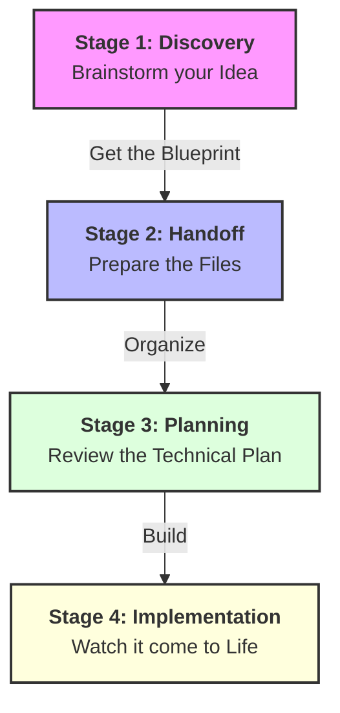

# 🚀 Feature Implementation Journey: From Ideas to Production

This guide explains how to take a new idea and turn it into a working feature using the **Kelas Vibe Coding** system. This process is designed to be simple, organized, and reliable.

---

## 🏗️ The 4-Stage Journey

---

## 💎 Stage 1: Discovery & Definition (The "Brain" Phase)
**Role**: Product Manager (AI Assistant)
1.  **Start the Conversation**: Tell the **Kelas Vibe Coding Elite PM Gem** about your new idea.
2.  **The Interview**: The AI will ask you a few questions to understand *exactly* what you need. Be sure to mention who will use it (Admin, Staff, or Customer).
3.  **The Recommendations**: The AI will suggest 3 "High Impact" features that are easy to build. Review and approve the ones you like.
4.  **Finalize**: Once you are happy, tell the AI to *"Finalize and Handoff."* It will give you a **Master Plan** and a **Design Brief**.

---

## 🤝 Stage 2: Handoff (The "Bridge" Phase)
**Role**: The User (You)
1.  **Create the Storage**: In your project editor, create two folders if they don't exist: `docs/prd` and `docs/design`.
2.  **Save the Plans**: 
    -   Create a new file in `docs/prd/` (e.g., `my-feature.md`) and paste the **Master Plan** there.
    -   Create a new file in `docs/design/` (e.g., `my-feature-brief.md`) and paste the **Design Brief** there.
3.  **High-Quality Design (Optional)**:
    -   Open the [Google Stitch Web App](https://stitch.google.com/).
    -   Paste the "Design Brief" code from your file to see the visual layout.
    -   **Important**: Click **"Download"** ⮕ **"Download Zip"**. Extract this folder so you can show the finished designs to the builder.

---

## 📐 Stage 3: Planning the Build (The "Blueprint" Phase)
**Role**: Engineering Agent (The Builder)
1.  **The Handoff**: Open your development chat and say: *"I want to implement [Feature Name]. The plans are in the docs/ folder."* If you downloaded a Design Zip, share those files too.
2.  **The Step-by-Step Plan**: The builder will automatically create a detailed technical plan. 
    - **Review**: The builder will show you exactly which parts of the app will change. 
    - **Approval**: If the plan looks correct and covers all your needs, give the "Go" to start building.

---

## 🛠️ Stage 4: Building & Quality Check (The "Execution" Phase)
**Role**: Engineering Agent (The Builder)
1.  **Watch the Build**: The builder will start creating your feature piece by piece. It will update the database, create the business logic, and finally build the user interface.
2.  **Visual Accuracy**: If you provided a design from Stitch, the builder will ensure the final result looks exactly like your design.
3.  **Safety & Performance**: The builder will automatically ensure your feature is secure, fast, and follows all professional coding standards.
4.  **Final Verification**: A final **Quality Check** is performed to ensure there are no bugs and everything is "Production Ready."

---

## 💡 Pro-Tips for Success
- **Save as Files**: Always save your plans as files in the `docs/` folder. This helps the builder remember exactly what to do.
- **High-Fidelity Designs**: Use the **Stitch Zip file** whenever possible. It's the best way to get a pixel-perfect user interface.
- **Keep it Simple**: Start with the "Must-Have" features first. You can always add more complexity later!
